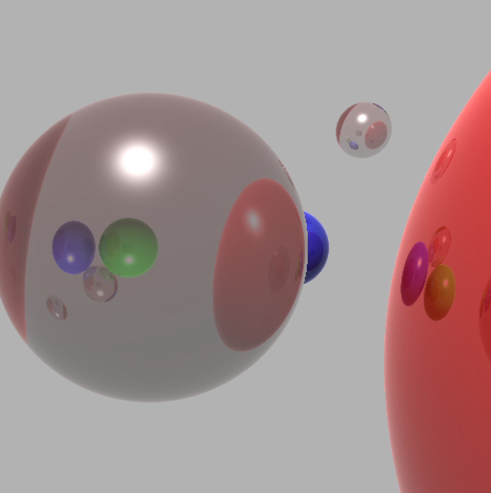
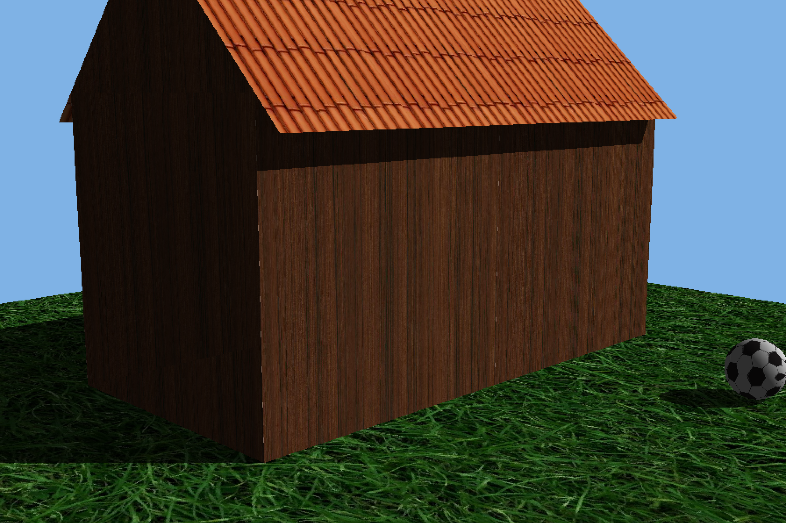

# Ray_tracer

## Features: 
- Spheres and triangle meshes
- Blinn-phong shading
- Lighting
    - Point lights
    - Directional lights
- Shadows
- Depth cueing 
- Light attenuation
- Texture (materials)
- Reflection
- Refraction
    - Transparent objects
        - Visibility attenuation
    - Total internal reflection

## Examples:

